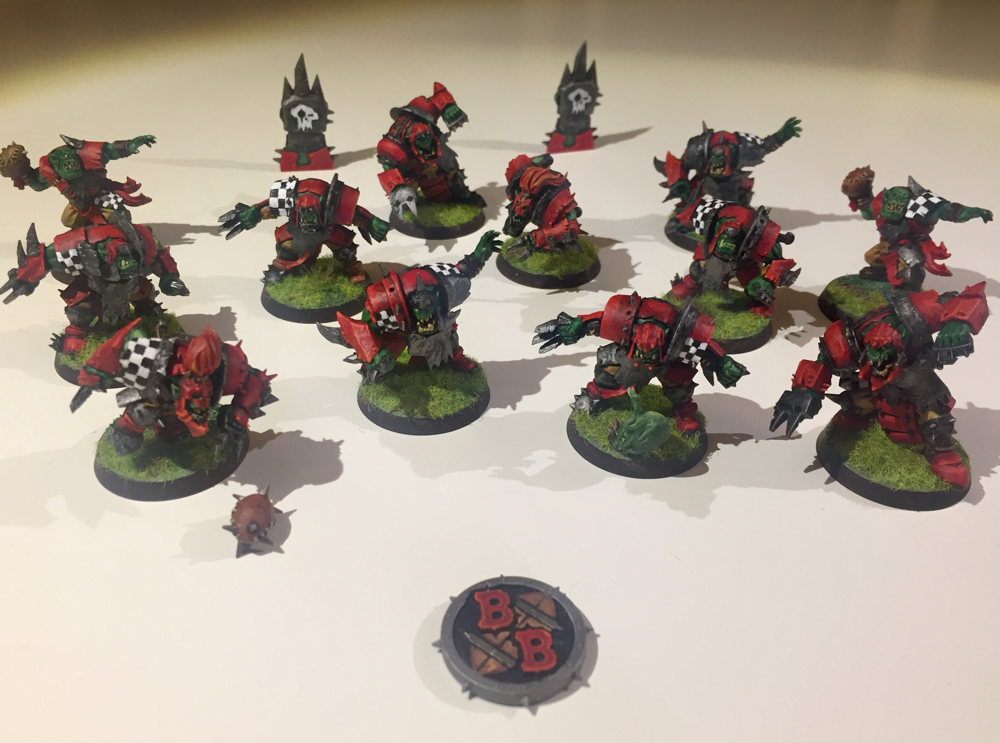
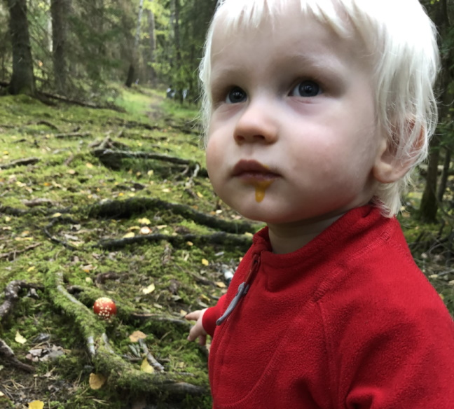
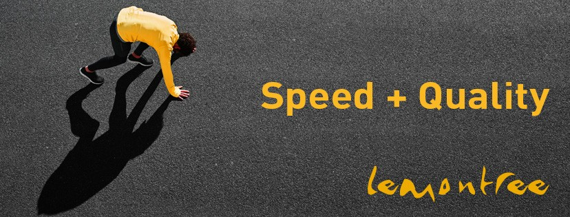
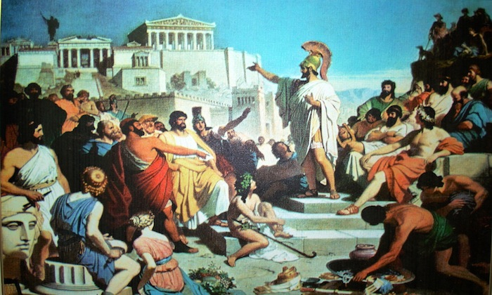
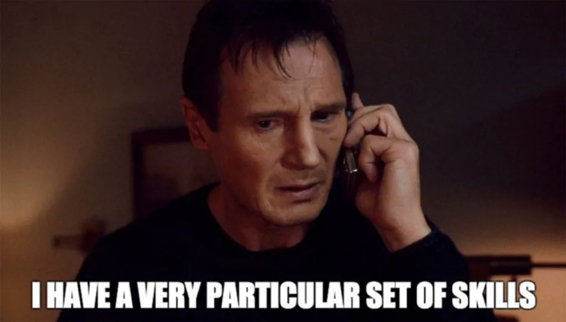
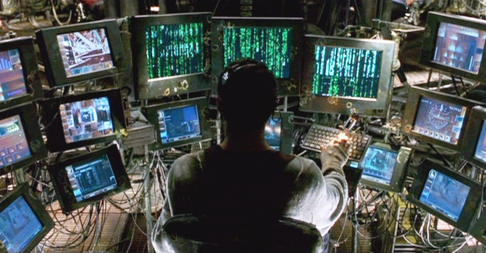
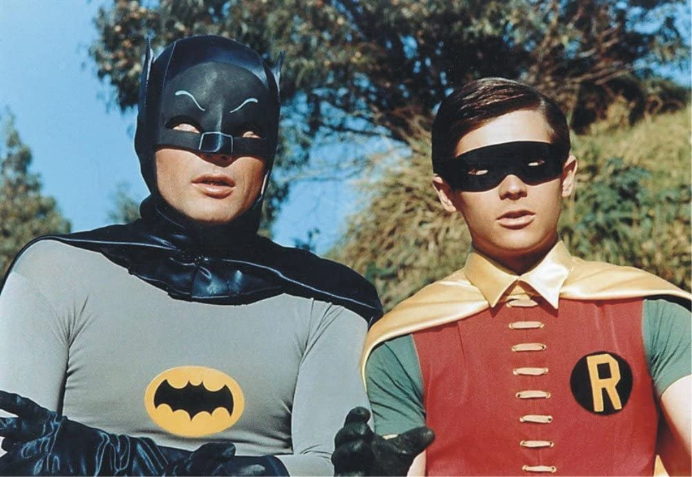
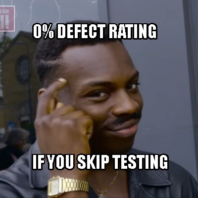

## En testares vardag
#### Newton Kompetensutveckling
#### 2020-11-26

***

### Vem är jag?

---

### Utvecklat i Microsoft.NET sedan 2003

---

### Brinner för kvalitet och förbättringsarbete

---

### Deltar i ledningsgruppen

---

### Gamer

 

---

### Förälder

***

### Min arbetsgivare

---

### Vi erbjuder

- Testautomatisering
- Testdatahantering
- Test as a Service
- DevOps
- Robotic Process Automation (RPA)
- m.m.

***

### Konsultuppdraget
> **Skatteverket** (värdmyndighet för Valmyndigheten).

---

### Vårt team

- 4 utvecklare
- 3 testare
- 2 kravare

*(varav 2 från YH)*

---

### Vårt mål

> Bygga ett **nytt valdatasystem** åt Valmyndigheten.

---

### Från monolit till microservices

***

### Från .NET till Java

<!-- TODO: Fyll på -->
- Stora likheter (särskilt m. Spring Boot)
- Svårt hitta verktyg för instrumentering, debug, felsöka minnesläckor m.m.

***

### Min vardag

---

### Kodgranskning

---

### Felsökning

---

### Övervakning av miljöer & loggar

---

### Parprogrammering och mentoring

---

### Ibland testar jag lite också

---

### Tester

- Automatiserade API-tester (Rest-Assured)
- Enhetstester (JUnit 5)
- Statisk kodanalys (Checkstyle, Sonarqube, XRay, m.m.)
- Utforskande tester (XMind)
- E2E-tester (Selenium, Protractor)
- Kontraktstester (Spring Cloud Contract)

***

### Tack för mig!

 @muamaidbengt

 github.com/muamaidbengt