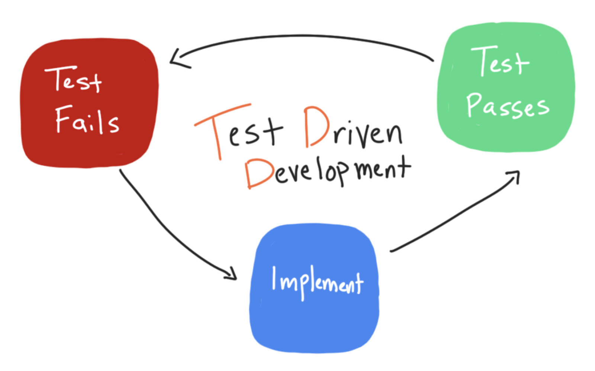
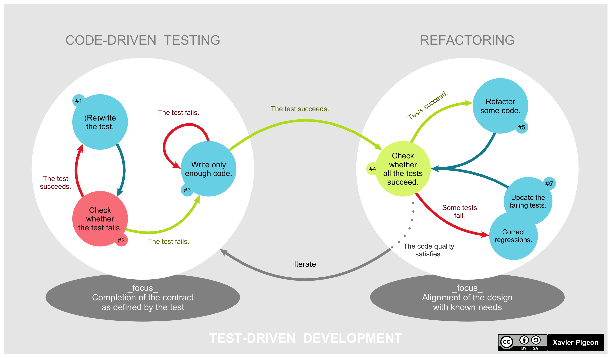
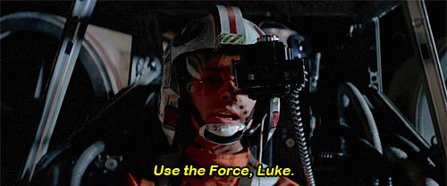

## Testdriven utveckling

<!-- .element: class="plain" -->
***

#### Traditionell utveckling

Design <!-- .element: class="horizontal-para"-->

&#8594; Utveckling <!-- .element: class="fragment horizontal-para"-->

&#8594; Test <!-- .element: class="fragment horizontal-para yellow"-->

---

#### Testdriven utveckling

Design <!-- .element: class="horizontal-para"-->

&#8594; Test <!-- .element: class="fragment horizontal-para yellow"-->

&#8594; Utveckling <!-- .element: class="fragment horizontal-para"-->

**Shift left!** <!-- .element: class="fragment" -->

***

### Vad är TDD?

- Rötter i eXtreme Programming/Test-First
- Iterativt arbetssätt (Red-Green-Refactor)
- Kan appliceras på flera nivåer (ATDD, DTDD, &hellip;)

Note:
Vi kommer fokusera på DTDD idag

---


<cite>`https://github.com/prakashshuklahub`</cite>

---

### TDD är inte enhetstester!

- Enhetstester är *viktiga* för TDD men *inte tillräckliga*
- I TDD bör testerna skrivas *innan* koden de testar
- På så sätt bidrar testerna till lösningens *design*

---

### Testdriven design?

 <!-- .element: class="plain" style="max-height: 500px" -->

---
<!-- .slide: data-background="black" -->
 <!-- .element: class="plain" style="max-height: 500px"-->

Note: 
- Vi gör i regel en hel massa design- och arkitekturbeslut up-front.
- Det finns alltid utrymme för den enskilde utvecklaren att fatta en hel massa designbeslut på egen hand
- Detta bör ske med nån slags eftertanke

---

### Exempel

```gherkin
  Som kund vill jag ta bort en vara ur korgen
  Så att jag kan fortsätta shoppa efter att jag har ångrat mig
```


```csharp [3]
[Test]
void Undo1() {
    Cart cart = CreateCartWithWidget();
    cart.RemoveAt(1);
    // The cart removes an item by its index
    cart.Should().NotContain(item -> item.Name == "Widget");
}
// Emergent design:
class Cart {
    public void RemoveAt(int index) { }
}
``` 
<!-- .element: class="fragment toggle zoom-in" data-line-numbers="3"  -->

```csharp
[Test]
void Undo2() {
    Cart cart = CreateCartWithWidget();
    cart.Remove("Widget");
    // The cart removes an item by its name
    cart.Should().NotContain(item -> item.Name == "Widget");
}
// Emergent design:
class Cart {
    void Remove(String itemToRemove) { }
}
``` 
<!-- .element: class="fragment toggle zoom-in" data-line-numbers="3"  -->

```csharp
[Test]
void Undo3() {
    Cart cart = CreateCartWithWidget();
    cart.GetItem(1).Remove();
    // The item removes itself from the cart(!?)
    cart.Should().NotContain(item -> item.Name == "Widget");
}
// Emergent design:
class Cart {
    CartItem Items(int index) { }
}
class CartItem {
    void Remove() { }
}
``` 
<!-- .element: class="fragment toggle" data-line-numbers="3" -->

```csharp
[Test]
void Undo4() {
    Cart cart = CreateCartWithWidget();
    CartService service = CreateCartService();
    Cart lighterCart = service.Remove(cart, "Widget");
    // The service removes the item from the cart and returns a new cart
    lighterCart.Should().NotContain(item -> item.Name == "Widget");
}
// Emergent design:
class CartService {
    Cart Remove(Cart cart, String thingToRemove) { }
}
``` 
<!-- .element: class="fragment toggle" -->

Note:
1. Cart-objektet kan ta bort innehåll, givet dess index
2. Cart-objektet kan ta bort innehåll, givet dess namn
3. Innehållet kan ta bort sig själv
4. En service-klass kan ta bort innehåll ur kundkorgen

***

### Fördelar med TDD

<ul>
<li class="fragment fade-in-then-semi-out"> Garanterar hög grad av <em>kodtesttäckning</em></li>
<li class="fragment fade-in-then-semi-out"> <em>Snabb feedback</em> på vår design</li>
<li class="fragment fade-in-then-semi-out"> Fostrar ett <em>självkritiskt tänkande</em> som kan leda iväg från "happy path"</li>
<li class="fragment fade-in-then-semi-out"> Testerna dokumenterar vår <em>intention</em> (som körbar kod)</li>
<ul>

Note: 
- 100% testtäckning != 0% buggar
- Det finns alltid luckor i vår design som är upp till mig att fylla igen
- när vi bygger en lösning fokuserar vi enbart på att få den ska funka. TDD hjälper oss fokusera på att ha sönder den
- Som utvecklare har jag alltid en vision om hur min kod är tänkt att fungera, anropas m.m.

***

## TDD
### Budorden

<ul>
<li class="fragment fade-in-then-semi-out">Du skall inte skriva någon produktionskod innan du har ett <span class="red">rött</span> test</li>
<li class="fragment fade-in-then-semi-out">Du skall inte skriva mer testkod än vad som behövs för att testet ska bli <span class="red">rött</span> </li>
<li class="fragment fade-in-then-semi-out">Du skall inte skriva mer produktionskod än vad som behövs för att testet ska bli <span class="green">grönt</span> </li>
</ul>
Note: 
- Budord 4: Du skall kontinuerligt förbättra all kod (viktigt!)

---

## TDD
### Metoden

1. Tillför ett nytt test <!-- .element: class="fragment"-->
2. Se att testet går rött <!-- .element: class="fragment fade-red"-->
3. Gör ändring <!-- .element: class="fragment"-->
4. Se att alla tester går grönt <!-- .element: class="fragment fade-green"-->
5. Städa upp <!-- .element: class="fragment"-->

---

## TDD

<!-- .element: class="plain" -->

Note:
- Vi skiftar mellan två olika processer
- Den vänstra tillför ny funktionalitet och bygger ut (test/utveckling)
- Den högra städar upp vår lösning och ser till att den håller i längden (design)

***

### Det här kräver Jedi-krafter


#### Eller? <!-- .element: class="fragment"-->

***

### Vad kan vi som testare göra?

 <!-- .element: class="plain fragment" -->
---

#### Parprogrammera
 <!-- .element: class="plain" -->

Note: 
- Coacha utvecklare att tänka test och tänka kritiskt om sin lösning

---

#### Förstå domänen

 <!-- .element: class="plain"-->

Note:
- Utvecklare är inte alltid så bra på att ta till sig den egentliga domänen
- När vi förstår domänen ordentligt kan vi kommunicera mer effektivt i teamet
- Vi kan koda testorakel som är meningsfulla och värdefulla för användaren 

---

#### Mäta/följa upp kodtesttäckning
 <!-- .element: class="plain"-->

Note:
- Diskutera kodtesttäckning. SonarQube m.fl. verktyg kan mäta täckning över tid. Sätt mål inom teamet
---

#### Öva TDD med Katas


Note:
- Öva TDD själv eller tillsammans i teamet genom att göra Katas (finns massor på nätet)

***

### Länkar

- [www.codewars.com](https://www.codewars.com/) - Community och onlineeditor för Katas (gå med i Lemontree-klanen!)
- [codekata.com](http://codekata.com/) - En samling tänkvärda Katas

***

### Tack för mig!


 <!-- .element: class="plain" --> @muamaidbengt


 <!-- .element: class="plain" --> github.com/muamaidbengt
