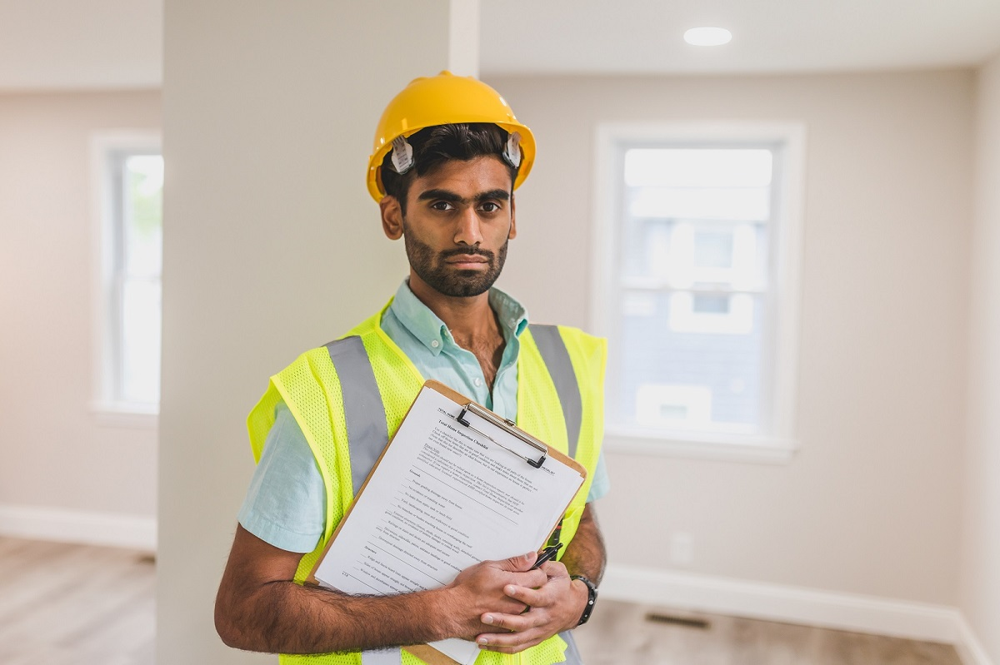

# Technical DD

## Testing to test the IT department?

#### Lemontree 2023

***

TODO: Nåt om hur många DDs vi gjort sedan vi började.

***

## Varför?

---

Note: Tänk att du ska köpa ett hus. Det är kanske ditt livs största affär. Då vill du såklart veta vad det är för skick på huset. Om taket kommer behöva bytas om 5 år vill du veta det, om rördragningarna i badrummen inte är fackmannamässigt gjorda vill du veta vilken risk det medför för vattenskada och utebliven ersättning på hemförsäkringen. Då behöver du en besiktningsperson som kan kritiskt granska huset och beskriva de brister som finns och ge förslag på åtgärder.

---

TODO: Nåt om hur processen ser ut vid en husbesiktning: frågeformulär, inhämta intyg från renoveringar etc., granskning på plats, ev. håltagning, fuktmätning m.m., -> slutrapport, ev. genomgång av rapport med beställare/köpare.

***

### Tack för mig

 @muamaidbengt

 github.com/muamaidbengt
