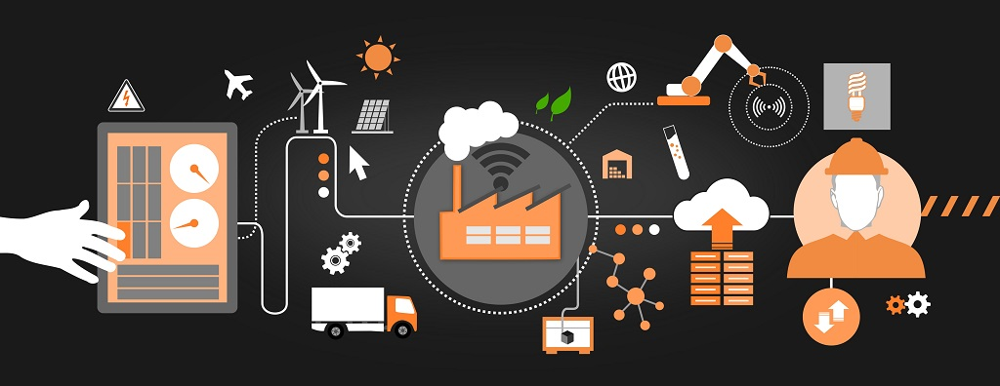

# Terraform

## Infrastructure as Code

#### Lemontree 2021

***

## Looking back

<div class="r-stack">
    
    <div>
        <ul class="contrast-text contrast-frame">
            <li>Physical hardware</li>
            <li>Long lead times</li>
            <li>Full spectrum IT operations</li>
        </ul>
    </div>
</div>

Note: Looking back to the time before the cloud, we were usually forced to deal with physical hardware whenever we wanted to build a new application or service. Perhaps we needed to order a new physical server to host the app. Fill out some change request to get the network team to open up the firewall restrictions. Mount disks and decide which level of redundancy we needed etc.

***

## Virtualization

<div class="r-stack">
    
    <div class="fragment">
        <ul class="contrast-text contrast-frame">
            <li>Virtualized hardware</li>
            <li>Shorter lead times</li>
            <li>Host/guest separation of duties</li>
        </ul>
    </div>
</div>

Note: Virtualization made it possible to pack services tighter, decreasing costs for operation and maintenance. It also allowed for more fungible solutions, for instance by adding more resources to an existing service as its load increased. Servers (or computing resources) were becoming more of a commodity, something that could be bought and discarded, rather than artifacts of their own.

***

## Cloud infrastructure

<div class="r-stack">
    
    <div class="fragment">
        <ul class="contrast-text contrast-frame">
            <li>Virtualized services</li>
            <li>Minimal lead times</li>
            <li>Flexible separation of duties (IaaS, PaaS etc)</li>
        </ul>
    </div>
</div>

Note: Cloud services built further upon virtualization and commodified not just computing resources, but more and more surrounding higher-level concepts as well. For instance, most cloud providers include off-the-shelf solutions for storage, logging and analytics services and firewall configuration.

***

## Infrastructure as Code

 <!-- .element: class="contrast-background"  -->

Note: While we're in some sense moving further away from physical hardware requirements, and have access to off-the-shelf solutions for common use cases, we still have a need to configure and connect these building blocks to achieve our business goals.

---

## IaC using Azure PS

(example borrowed with 💜 from @zerokoll)

```powershell [|2,5-6,9-10]
New-AzResourceGroup `
    -Name "MyRG" `
    -Location "West Europe"
New-AzAppServicePlan `
    -ResourceGroupName "MyRG" `
    -Name "MyAppSvcPlan" `
    -Location "West Europe" `
    -Tier "Free"
New-AzWebApp `
    -ResourceGroupName "MyRG" `
    -Name "MyWebApp" `
    -Location "West Europe" `
    -AppServicePlan "MyAppSvcPlan"
```

Imperative! <!-- .element: class="fragment"-->

💥 Not idempotent! <!-- .element: class="fragment"-->

---

## IaC Example using Azure CLI

```sql
az group create --name MyRG --location westeurope
az appservice plan create --resource-group MyRG --name MyAppSvcPlan --sku FREE
az webapp create --resource-group MyRG --plan MyAppSvcPlan --name MyWebApp
```

Imperative! <!-- .element: class="fragment"-->

Idempotent! <!-- .element: class="fragment"-->

---

## IaC using Terraform


```sh [|1|2-3]
$ terraform init
$ terraform plan
$ terraform apply
```


Declarative! <!-- .element: class="fragment"-->

Idempotent! <!-- .element: class="fragment"-->

***

### Tack för mig

 @muamaidbengt

 github.com/muamaidbengt